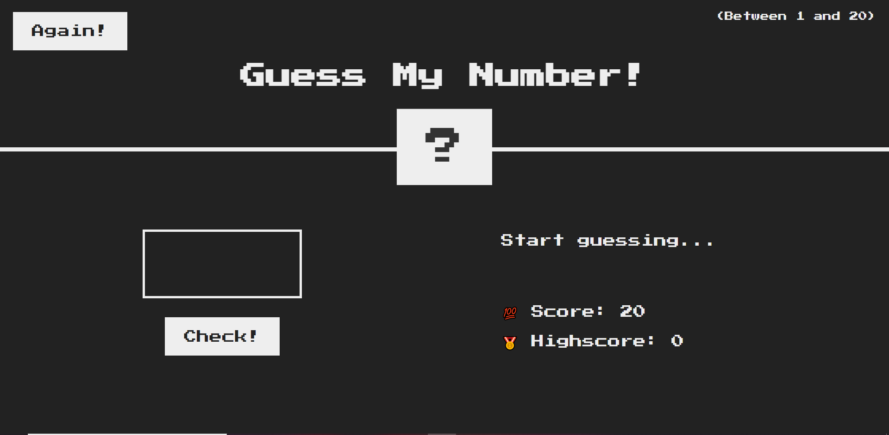

<!-- PROJECT LOGO -->
 

  

  <h1 align="center">Guess My Number</h1>

<!-- TABLE OF CONTENTS -->

  
Table of Contents

  <ol>
    <li>
      <a href="#about-the-project">About The Project</a>
    </li>
    <li><a href="#built-with">Built with</a></li>
    <li>Screenshot</li>
    <li><a href="#contact-me"> Contact me</a></li>
    
    
    
  </ol>

<!-- ABOUT THE PROJECT -->
## About The Project

Guess My Number is a quick, fun, and easy opening game to lead with a small group or the entire class. Students try to guess the number you’re thinking of in the fewest number of guesses possible

## Built With

* [JAVASCRIPT](https://www.javascript.com/)
* [CSS](https://www.css.com/)
* [HTML](https://www.html.com/)

<!-- CONTACT -->
## Contact me
<ul>
  <li>Created by --  Aditya Yaduvanshi</li>
  <li>Twitter -- <a href="https://twitter.com/fixslyr">Fixslyr</a>
    <li>Instagram -- <a href="https://www.instagram.com/fixslayrxx/">Aditya Yaduvanshi</a>
      <li>Linkedin -- <a href="https://www.linkedin.com/in/theaditya-yaduvanshi-/">Aditya Yaduvanshi</a>
  </ul>    
    

<td>Facebook  </td>

